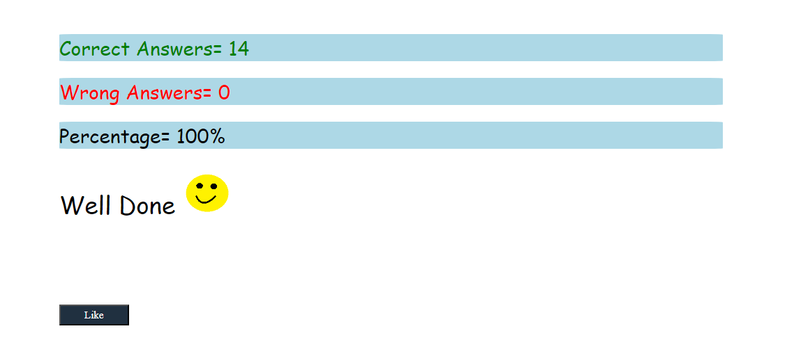

 ## 1 : What are the variable naming conventions in JavaScript?
 
 Ans : Variable names must start with a letter, an underscore ( _ ) or a dollar sign ( $ ).

 ## 2: Create a greeting alert (use => prompt, message, alert)?

 Ans : 
 ```js
let yourName=prompt("what is your name")
alert(`Good Morning ${yourName}`)

 ```

 ## 3 : Write some code so that the values of the below variables switch around 
## Let a = 5, let b = 8. Switch the value so that a holds the value 8 and the variable b holds the value 5


```js
let a=5
let b=8

let c=b
    b=a
    a=c

console.log(a)
console.log(b)


```

## 4 : Result

